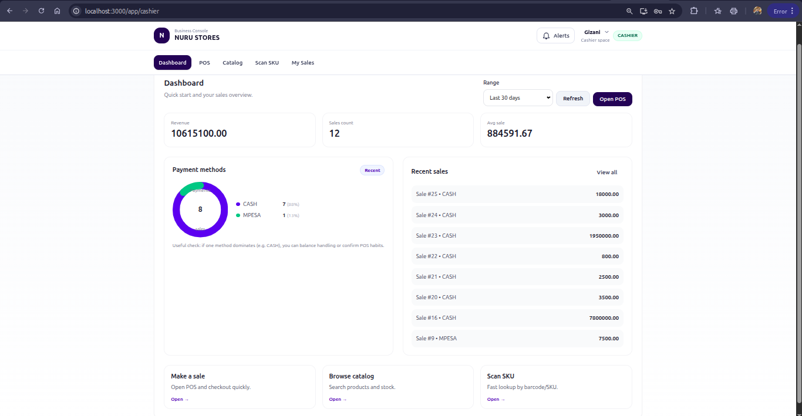
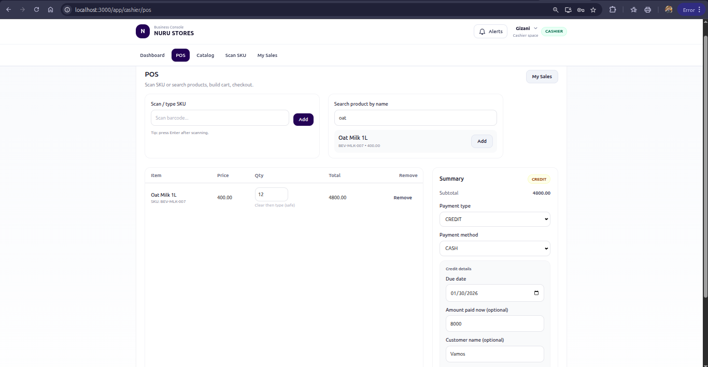
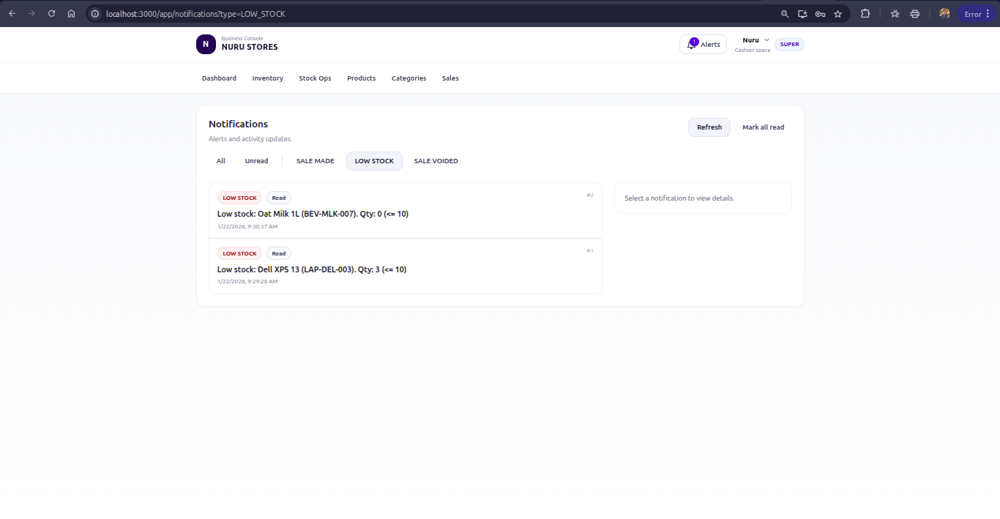

# 🏪 Nuru Stores  
**Inventory • POS • Sales • Notifications**  
_Django REST API + React UI_

---

## Overview

**Nuru Stores** is a modern inventory and sales management system designed for small to medium retail operations.  
It combines a **Django REST backend** with a **React frontend** to deliver:

- Fast POS checkout
- Real-time inventory awareness
- Role-based dashboards (Owner vs Cashier)
- Receipts & invoices
- Actionable notifications

---

## User Roles

### Owner
- Full system control
- Inventory & catalog management
- Stock operations & movements
- Business dashboard (inventory health, KPIs)
- Notifications & alerts
- Sales overview

### Cashier
- POS checkout
- Scan SKU / browse catalog
- View sales
- Print receipts & invoices
- Limited dashboard (personal performance + activity)

> Owners are defined as `is_superuser` **or** users with `role === "OWNER"`.

---

## Core Features

### Authentication & Access Control
- JWT-based authentication
- Protected routes
- Role-based navigation & permissions
- Profile & password management

---

### Catalog Management
- Categories (nested support)
- Products
- SKU-based identification
- Price & stock tracking

---

### Sales & POS
- Cashier POS interface
- Create sales
- View sale details
- Generate **Receipts** and **Invoices**
- Supports multiple payment methods

---

### Inventory
- Inventory listing
- Stock operations (restock / supply)
- Stock movement history (IN / OUT)
- Low-stock & out-of-stock detection
- Inventory health overview

---

### Notifications
- Sale made alerts
- Low stock alerts
- Sale voided alerts
- Unread count polling
- Mark read / mark all read
- Navigate directly to related sale or product

---

## Dashboards

### Owner Dashboard
- Key KPIs (Revenue, Sales Count, Avg Sale)
- Inventory Status
  - In stock
  - Low stock
  - Out of stock
- Top products
- Recent stock movements
- Notifications preview

### Cashier Dashboard
- Sales KPIs
- Payment Methods
- Recent sales
- Quick actions (POS, Catalog, Scan SKU)

---

## 🏗 Tech Stack

### Backend
- Python
- Django
- Django REST Framework
- JWT Authentication

### Frontend
- React
- React Router
- Tailwind CSS
- Modular API clients

---

## Project Structure
```text
nuru_store/
├── catalog/
├── inventory/
├── notifications/
├── sales/
├── users/
├── config/
├── manage.py
├── requirements.txt
└── frontend/
```

---

## Getting Started

### 1️⃣ Backend Setup (Django)

```bash
python -m venv venv
source venv/bin/activate
pip install -r requirements.txt
```

Run migrations and create a superuser

```bash
python manage.py migrate
python manage.py createsuperuser
```

Start a backend server

```bash
python manage.py runserver 8000
```

Backend runs at

```bash
http://127.0.0.1:8000/
```

### 2️⃣ Frontend Setup (React)

```bash
cd frontend
npm install
npm run dev
```

Frontend runs at
```bash
http://localhost:3000/
```

⚙ Environment Variables
```text
DEBUG=True
SECRET_KEY=your_django_secret_key

DB_NAME=database_name
DB_USER=database_user
DB_PASSWORD=your_password
DB_HOST=localhost
DB_PORT=5432

ALLOWED_HOSTS=127.0.0.1,localhost
```

---

### Frontend Routes
#### Public
```bash
/login
/register
/unauthorized
```

#### Shared (Authenticated)
```bash
/app/profile
/app/change-password
/app/notifications
/app/sales
/app/sales/:id
/app/sales/:id/receipt
/app/sales/:id/invoice
```

#### Cashier Routes
```bash
/app/cashier
/app/cashier/pos
/app/cashier/catalog
/app/cashier/scan
```

#### Owner Routes
```bash
/app/owner
/app/owner/catalog/categories
/app/owner/catalog/products
/app/owner/inventory
/app/owner/inventory/ops
/app/owner/inventory/movements
```

---

### Screenshots

- Create a ```screenshots/ directory``` in the repository.

#### Login


#### Owner Dashboard


#### Cashier Dashboard


#### POS


#### Notifications


#### Invoice


---

## License
This project is licensed under the terms of the [MIT License](LICENSE).
